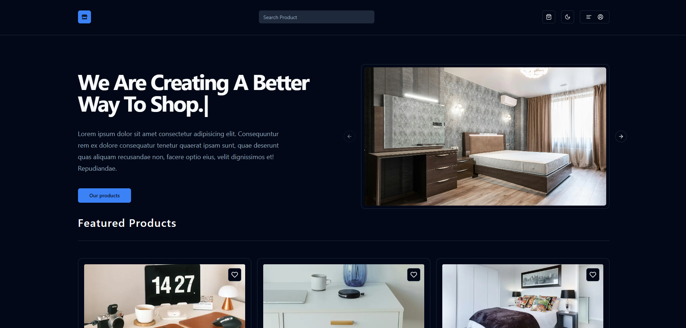

# Next Store



Welcome to my first Next.js project — Next Store!

This is a typical e-commerce website that includes most of the essential features you'd expect from an e-commerce platform. You can [preview](https://next-store-zeta.vercel.app/) the project hosted on Vercel.

In this project, I dive into the fundamentals of Next.js and integrate other cool libraries for building modern web applications.

---

## Tech Stack

Here’s the list of technologies I used to build this project:

- **Next.js** - For building the web app.
- **Tailwind CSS** - For styling.
- **ShadCN UI** - For UI components.
- **Prisma** - For database interaction.
- **Supabase** - For storing data in the database.
- **Clerk** - For authentication and authorization.

---

> **Note:** This project is built on **Next.js 15**, but I used an older version of the **Clerk** library. As a result, there are some optimization issues.

---

## To Run This Project On Your Local Machine

### 1. Clone The Repository

```bash
git clone https://github.com/h0dy/next-store.git
```

### install dependencies

```bash
npm install
```

## Set Up Environment Variables

To run this project locally, you will need to add the following environment variables to your .env file

### For Prisma (Database):

`DB_PASSWORD`=your_prisma_db_password

`DATABASE_URL`=your_prisma_connection_string

`DIRECT_URL`=your_prisma_direct_string


### For Supabase:

`SUPABASE_URL`=your_supabase_url

`SUPABASE_KEY`=your_supabase_key


### For Clerk (Authentication):

Create a .env.local file for Clerk and add the following:

`NEXT_PUBLIC_CLERK_PUBLISHABLE_KEY`=your_clerk_publishable_key

`CLERK_SECRET_KEY`=your_clerk_secret_key

### Additionally, you'll need to add the ADMIN_USER_ID (from Clerk) to access admin privileges:

`ADMIN_USER_ID`=your_clerk_user_id

### run the server

```bash
npm run dev
```
